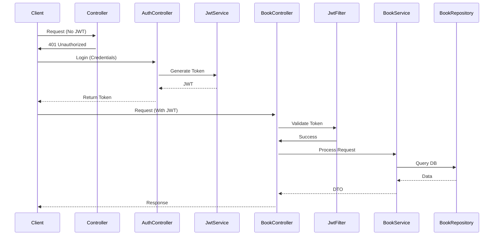
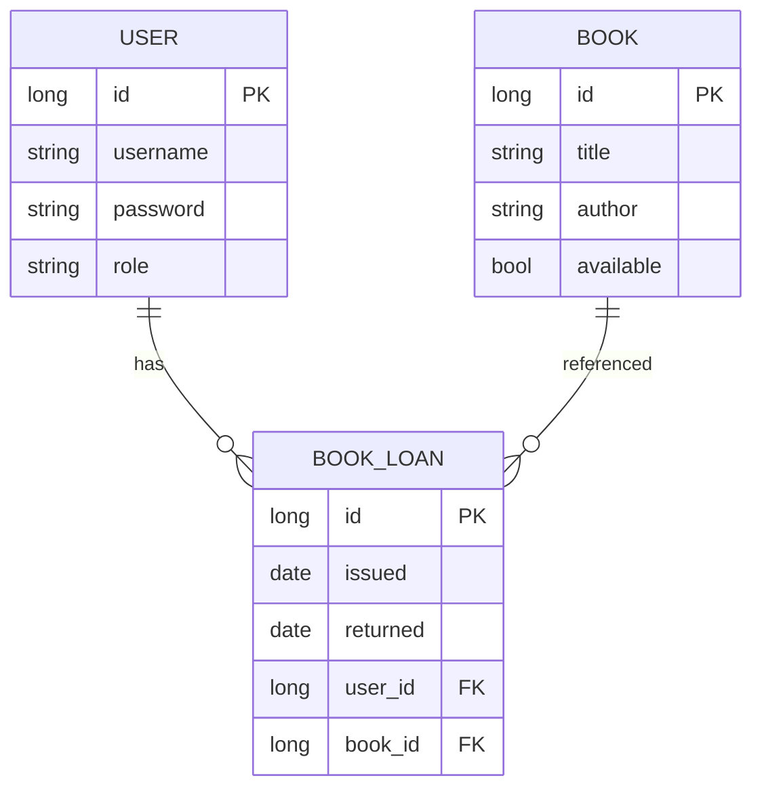

# 📚 Library Management System – Spring Boot + MySQL + JWT

A complete backend project for managing library operations such as user registration, book issuing/returning, and admin-level book management with **role-based JWT authentication**.

---

## 🚀 Features

- 🔐 JWT-based Login & Signup (User & Admin)
- 📚 Admin-only Book Management (Add, Update, Delete)
- 📖 Issue and Return Books (for authenticated users)
- 🛡️ Role-based Authorization using Spring Security
- 🧾 MySQL database integration
- 📄 REST API with DTOs and service abstraction

---


## 🧩 Dependencies Used

These are the key libraries and dependencies included via Maven:

- `spring-boot-starter-web` – REST APIs
- `spring-boot-starter-security` – Authentication & Authorization
- `spring-boot-starter-data-jpa` – ORM and Repository support
- `mysql-connector-j` – MySQL database driver
- `jjwt` (0.11.5) – JSON Web Token (JWT) for stateless auth
- `lombok` – Boilerplate reduction (getters, setters, builders)
- `spring-boot-devtools` – Auto reload during development (optional)
- `h2` – In-memory DB for local development/testing

---


Here's a complete `ARCHITECTURE.md` file for your Library Management System following your specified components:

```markdown
# Library Management System Architecture

## 🏗️ Layered Architecture

```
src/
├── main/
│   ├── java/
│   │   ├── controller/       # API endpoints
│   │   ├── dto/             # Data Transfer Objects  
│   │   ├── entity/          # JPA entities
│   │   ├── repository/      # Database interfaces
│   │   ├── security/        # Auth configuration
│   │   ├── service/         # Business logic
│   │   └── util/            # JWT utilities
│   └── resources/
│       └── application.yml  # Configurations
```

## 🔄 Flow of Control

1. **Request** → Controller → Service → Repository → Database  
2. **Response** → DTO → Service → Controller → Client


```

## 🛡️ Security Flow



## 📦 Database Schema



## 🔧 How to Extend

1. **Add new feature**:
   - Create Entity → Repository → Service → Controller
   - Define Request/Response DTOs
   - Configure security permissions

2. **Modify existing**:
   - Update DTOs for new fields
   - Extend service logic
   - Add repository methods
```

This markdown file provides:
1. Clear directory structure
2. Code snippets for each layer
3. Visual workflow diagrams
4. Database schema
5. Extension guidelines

Would you like me to add any specific implementation details or modify any section?


## 🏗️ Detailed Project Architecture

```
Library_Management/
├── Controller/                # Handles REST API endpoints
│   ├── AdminController.java
│   ├── AuthController.java
│   ├── BookController.java
│   └── IssueRecordController.java
│
├── DTO/                      # Data Transfer Objects
│   ├── BookDTO.java
│   ├── LoginRequestDTO.java
│   ├── LoginResponseDTO.java
│   └── RegisterRequestDTO.java
│
├── Entity/                   # Database entities (JPA)
│   ├── Book.java
│   ├── IssueRecord.java
│   └── User.java
│
├── JWT/                      # JWT Utilities and Filters
│   ├── JWTAuthenticationFilter.java
│   └── JwtService.java
│
├── Repository/               # JPA Repository Interfaces
│   ├── BookRepository.java
│   ├── IssueRecordRepository.java
│   └── UserRepository.java
│
├── Security/                 # Spring Security Configuration
│   └── SecurityConfig.java
│
├── Service/                  # Business Logic Layer
│   ├── AuthenticationService.java
│   ├── BookService.java
│   ├── CustomUserDetailsService.java
│   └── IssueRecordService.java
│
├── application.yml           # Project Configuration (DB, JWT, etc.)
└── LibraryManagementApplication.java  # Spring Boot Starter
```

---

## 🛠️ Tech Stack

| Layer           | Technology                       |
|----------------|-----------------------------------|
| Framework      | Spring Boot 3.x                   |
| Security       | Spring Security + JWT             |
| ORM            | Hibernate (JPA)                   |
| Database       | MySQL                             |
| Auth           | JWT (jjwt) + BCrypt               |
| Build Tool     | Maven                             |
| Language       | Java 17+                          |

---

## 🧱 Project Architecture

```
Library_Management/
├── Controller/
├── DTO/
├── Entity/
├── JWT/
├── Repository/
├── Security/
├── Service/
├── application.yml
└── LibraryManagementApplication.java
```

---

## ⚙️ Configuration - `application.yml`

```yaml
spring:
  datasource:
    url: jdbc:mysql://localhost:3306/libraryManagement
    username: root
    password: root
    driver-class-name: com.mysql.cj.jdbc.Driver

  jpa:
    hibernate:
      ddl-auto: update
    show-sql: true
    properties:
      hibernate:
        dialect: org.hibernate.dialect.MySQL8Dialect

jwt:
  secretkey: Y9z2XK!q8wA3sDfL#eT6GmNpRx1UoVbC
  expiration: 3600000  # 1 hour in milliseconds
```

---

## 🔐 Authentication

All protected endpoints require a valid JWT in the `Authorization` header.

```
Authorization: Bearer <your_token>
```

---

## 📘 API Endpoints

### 🔐 Auth

| Method | Endpoint                     | Role        | Description               |
|--------|------------------------------|-------------|---------------------------|
| POST   | `/auth/registerNormalUser`   | Public      | Register normal user      |
| POST   | `/admin/registerAdminUser`   | Admin       | Register an admin         |
| POST   | `/auth/login`                | Public      | Authenticate & receive JWT|

---

### 📚 Book Management (Admin)

| Method | Endpoint                     | Role        | Description         |
|--------|------------------------------|-------------|---------------------|
| POST   | `/books/addbook`             | Admin       | Add new book        |
| PUT    | `/books/updatebook/{id}`     | Admin       | Update book details |
| DELETE | `/books/deletebook/{id}`     | Admin       | Delete a book       |

---

### 📖 Book Access (User)

| Method | Endpoint                     | Role        | Description        |
|--------|------------------------------|-------------|--------------------|
| GET    | `/books/getallbooks`         | User/Admin  | View all books     |
| GET    | `/books/getbookbyid/{id}`    | User/Admin  | Get book by ID     |
| POST   | `/issuerecords/issue/{id}`   | User        | Issue a book       |
| POST   | `/issuerecords/return/{id}`  | User        | Return a book      |

---

## 🧪 Run the Project

### 1. Clone the repository
```bash
git clone https://github.com/your-username/Library_Management.git
cd Library_Management
```

### 2. Create MySQL DB
```sql
CREATE DATABASE libraryManagement;
```

### 3. Run with Maven
```bash
mvn spring-boot:run
```

---


## 👨‍💻 Author

**B Rahul Naik**  
Java Backend Developer | Spring Boot | JWT | Full Stack Enthusiast  
📧 Email: banavathrahulnaik26@gmail.com  
🔗 [LinkedIn](https://www.linkedin.com/in/rahulnaik-banavath-293699367?utm_source=share&utm_campaign=share_via&utm_content=profile&utm_medium=android_app)  

---

## 📄 License

MIT License – Free to use, improve, and distribute.


---

